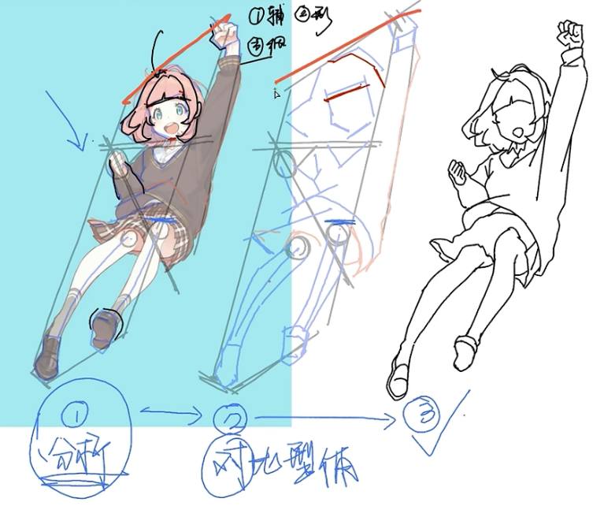

## 学习误区

1. 没了解就随便问问题
2. 光学不**练**不**记笔记**（记不懂的不会的）
3. 练了不做**总结**
	- 原创需要靠临摹、不断画质量提高
	- 效率 质量、数量
4. 没有正确的学习逻辑
5. 软件基础不好
	- PS/SAI、ProCreate 等

> 努力固然重要，正确的努力效率最高。

## 坚持

- 看图
- 临摹、去画，小练习
- 养成习惯，分类存图

## 造型学习

两个大块：造型 + 色彩

- 造型：角色、场景等 → 黑白
	- 头型设计、动态等
	- 形体临摹（观察能力）、人体结构（比例）、人体动态（基础就是结构）、线条表达、局部风格、服装设计（人体结构、走向 - 褶皱、设计 - 款式）、成品构图
	- 怎样去临摹：用（辅助）线框住（切出形状）
- 色彩：
	- 软件基础、色彩基础、配色训练、光与影体积（暗亮）
	- 软件技巧之环境光训练：局部示范 - 赛璐璐技法 + 伪厚涂技法

## 软件基础

一、新建文件 A4 纸大小 300 分辨率

二、保存文件 源文件有图层

- **psd** → PS
- sai → SAI

三、导出文件 文件格式

- jpg/jpeg 小点 有背景
- png 大 **透明背景**

四、工作区/窗口摆放

## 临摹学习

先练**形**，用实体无压感笔刷练习，这个过程会同时练**线**

1. 分析原图
2. 画辅助线定结构和点位
	- 用辅助线切，把临摹物体框住（最明显的，不用去框细节）
	- 大概比例打点
	- 关键形体位置画线定位
3. 细节形状

