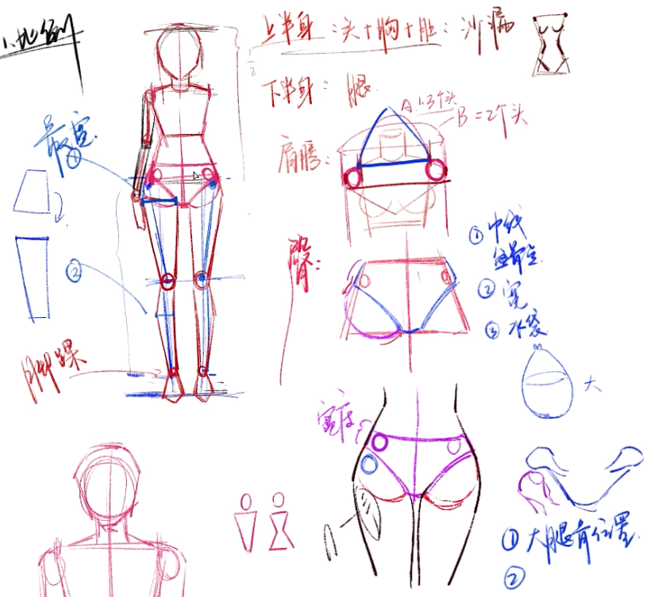
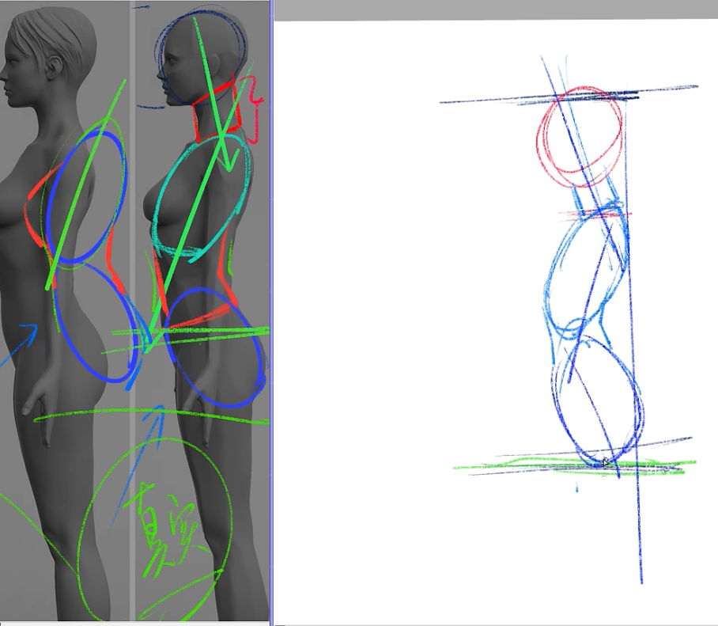
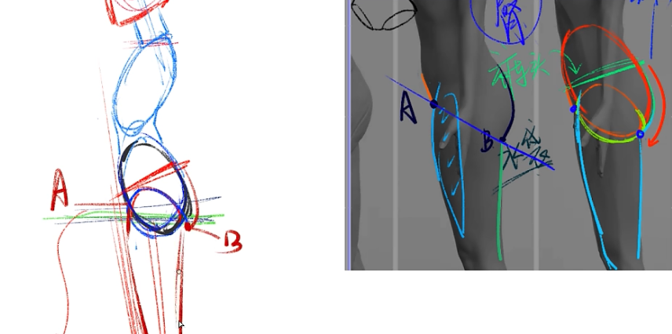
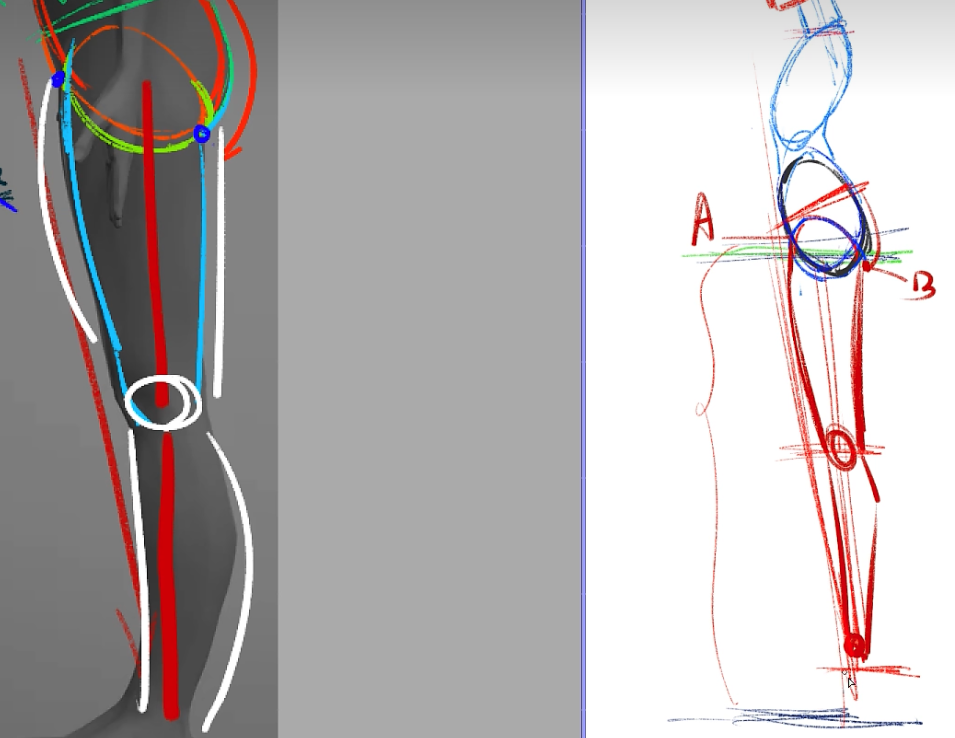
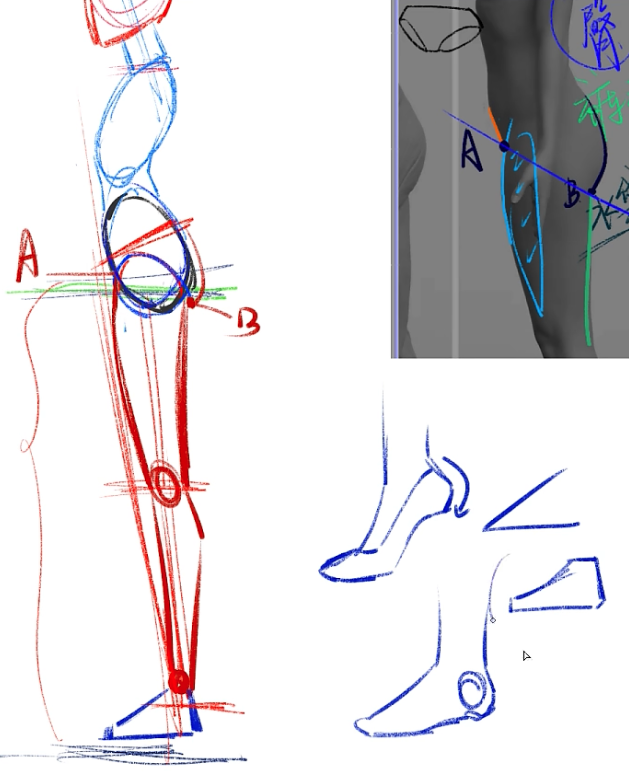
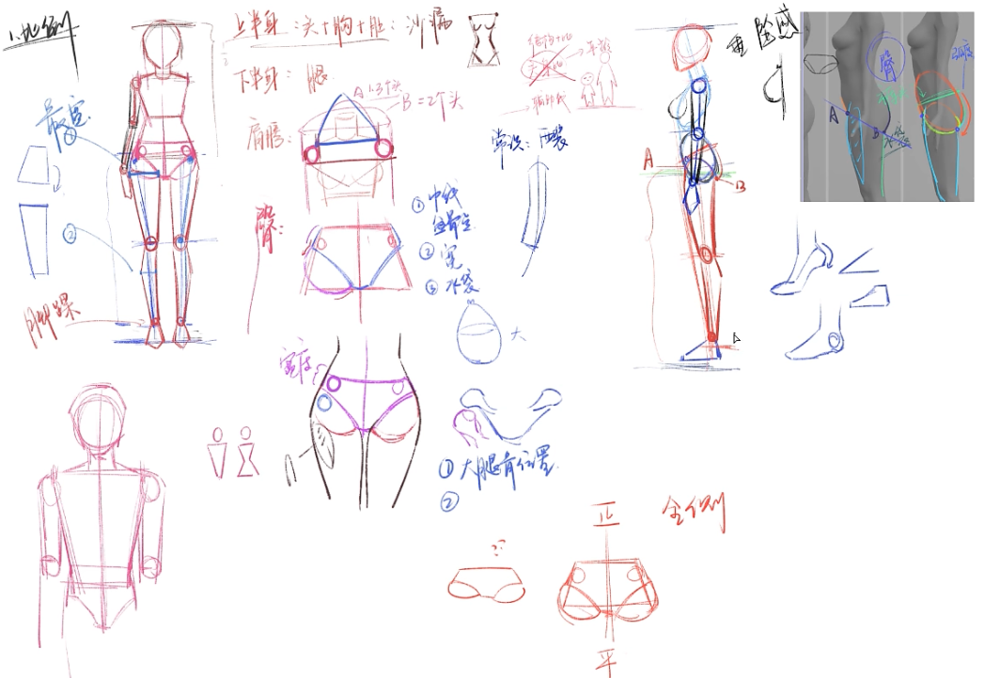
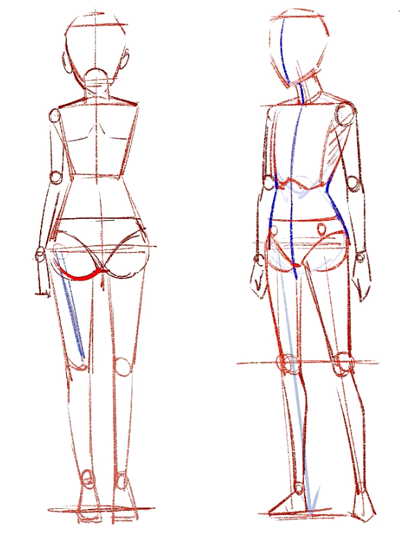

人体三个角度的：正面、侧面、背面

比例

## 正面

上半身：头部 + 胸腔 + 肚子 + 臀部区分上下 —— 沙漏形状

- 头：
- 肩膀：不包括手臂宽度为 1.3~1.5 个头（一般按这个画，盆骨和这个一样宽），包括手臂宽度为 2 个头
- 臀部：梯形

下半身：腿

人体动态三条线：肩膀、骨盆、中线

## 侧面

头、脖子、胸腔、腰

臀部

大腿、膝盖、小腿

脚踝、脚掌

手臂：正常状态是有点弯曲的

## 背面、半侧面

## 头部

起稿、角度、发际线、五官十字线、耳朵和脖子
